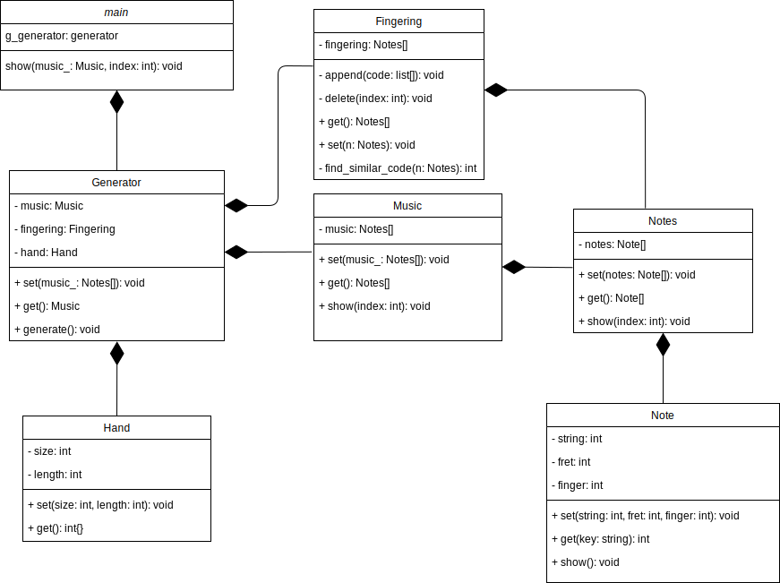

# Documentation

## Diagram

Class diagram

 

## [class Generator](Generator.md)

Manages all processes to generate effieicnt fingering.

효율적인 운지법을 생성하는 모든 과정을 총괄하는 클래스.

## [class Fingering](Fingering.md)

Manages fingering about basic guitar codes.

기본적인 기타 코드들의 운지법을 관리하는 클래스.

## [Class Music](Music.md)

Manages music sheet data.

악보 데이터를 관리하는 클래스.

## [Class Notes](Notes.md)

Manages note data that plays at the same time.

동시에 연주하는 음들의 데이터를 관리하는 클래스.

## [Class Note](Note.md)

Manages note data.

특정한 음의 데이터를 관리하는 클래스.

## [Class Hand](Hand.md)

Manages user's hand information

사용자의 손에 대한 정보를 관리하는 클래스.
